# UVI (Unified Verb Index) Package

## TODO: CLEAN UP DOCS

A comprehensive standalone Python package providing integrated access to nine linguistic corpora with cross-resource navigation, semantic validation, and hierarchical analysis capabilities through a modular helper class architecture.

## Table of Contents

- [Overview](#overview)
- [Architecture](#architecture)
- [Installation](#installation)
- [Quick Start](#quick-start)
- [Core Features](#core-features)
- [API Reference](#api-reference)
- [Examples](#examples)
- [Performance](#performance)
- [Troubleshooting](#troubleshooting)
- [Contributing](#contributing)
- [License](#license)

## Overview

The UVI package implements universal interface patterns and shared semantic frameworks through a modular architecture of specialized helper classes, enabling seamless cross-corpus integration and validation across these linguistic resources:

### Supported Corpora

1. **VerbNet** - Hierarchical verb classifications with semantic and syntactic information
2. **FrameNet** - Frame-based semantic analysis with lexical units and relations
3. **PropBank** - Predicate-argument structure annotations with semantic roles
4. **OntoNotes** - Multilingual sense inventories and cross-resource mappings
5. **WordNet** - Lexical semantic network with synset relationships
6. **BSO (Broad Semantic Ontology)** - VerbNet class mappings to semantic categories
7. **SemNet** - Integrated semantic networks for verbs and nouns
8. **Reference Documentation** - Predicate definitions, thematic roles, and constants
9. **VN API** - Enhanced VerbNet data with additional API features

### Key Capabilities

- **Modular Architecture**: Refactored from monolithic 126-method class to 8 specialized helper classes
- **Unified Access**: Single interface to all nine linguistic corpora
- **Cross-Corpus Navigation**: Discover relationships between different resources
- **Semantic Analysis**: Complete semantic profiles across all corpora
- **Data Validation**: Schema validation and integrity checking
- **Multiple Export Formats**: JSON, XML, CSV export with filtering
- **Performance Optimized**: Efficient parsing and caching strategies
- **Framework Independent**: Works in any Python environment

## Architecture

```mermaid
graph TB
    subgraph "Public Interface"
        UVI[UVI Main Class<br/>Public API Methods]
    end
    
    subgraph "Helper Classes Layer"
        SE[SearchEngine<br/>Search & Query]
        CR[CorpusRetriever<br/>Data Retrieval]
        CRM[CrossReferenceManager<br/>Cross-Corpus Navigation]
        RDP[ReferenceDataProvider<br/>Reference Data]
        VM[ValidationManager<br/>Validation]
        EM[ExportManager<br/>Export Functions]
        AM[AnalyticsManager<br/>Analytics]
        PE[ParsingEngine<br/>Parsing Ops]
    end
    
    subgraph "CorpusLoader Components"
        CP[CorpusParser<br/>XML/File Parsing]
        CCB[CorpusCollectionBuilder<br/>Collection Building]
        CCV[CorpusCollectionValidator<br/>Validation Logic]
        CCA[CorpusCollectionAnalyzer<br/>Analytics & Stats]
    end
    
    subgraph "Data Layer"
        VN[VerbNet]
        FN[FrameNet]
        PB[PropBank]
        ON[OntoNotes]
        WN[WordNet]
        BSO[BSO]
        SN[SemNet]
        REF[References]
        API[VN API]
    end
    
    %% UVI delegates to Helper Classes
    UVI --> SE
    UVI --> CR
    UVI --> CRM
    UVI --> RDP
    UVI --> VM
    UVI --> EM
    UVI --> AM
    UVI --> PE
    
    %% Helper Classes integrate with CorpusLoader Components
    SE --> CCA
    SE --> CCB
    CR --> CP
    CR --> CCB
    CRM --> CCV
    RDP --> CCB
    VM --> CCV
    VM --> CP
    EM --> CCA
    AM --> CCA
    PE --> CP
    
    %% CorpusLoader Components access Data Layer
    CP --> VN
    CP --> FN
    CP --> PB
    CP --> ON
    CP --> WN
    CP --> BSO
    CP --> SN
    CP --> REF
    CP --> API
    
    CCB --> VN
    CCB --> FN
    CCB --> PB
    
    CCV --> VN
    CCV --> FN
    CCV --> PB
    
    CCA --> VN
    CCA --> FN
    CCA --> PB
    
    style UVI fill:#e1f5fe,stroke:#000,color:#000
    style SE fill:#fff3e0,stroke:#000,color:#000
    style CR fill:#fff3e0,stroke:#000,color:#000
    style CRM fill:#fff3e0,stroke:#000,color:#000
    style RDP fill:#fff3e0,stroke:#000,color:#000
    style VM fill:#fff3e0,stroke:#000,color:#000
    style EM fill:#fff3e0,stroke:#000,color:#000
    style AM fill:#fff3e0,stroke:#000,color:#000
    style PE fill:#fff3e0,stroke:#000,color:#000
    style CP fill:#f3e5f5,stroke:#000,color:#000
    style CCB fill:#f3e5f5,stroke:#000,color:#000
    style CCV fill:#f3e5f5,stroke:#000,color:#000
    style CCA fill:#f3e5f5,stroke:#000,color:#000
    style VN fill:#e8f5e9,stroke:#000,color:#000
    style FN fill:#e8f5e9,stroke:#000,color:#000
    style PB fill:#e8f5e9,stroke:#000,color:#000
    style ON fill:#e8f5e9,stroke:#000,color:#000
    style WN fill:#e8f5e9,stroke:#000,color:#000
    style BSO fill:#e8f5e9,stroke:#000,color:#000
    style SN fill:#e8f5e9,stroke:#000,color:#000
    style REF fill:#e8f5e9,stroke:#000,color:#000
    style API fill:#e8f5e9,stroke:#000,color:#000

```



### Helper Classes

1. **SearchEngine**
   - Cross-corpus search
   - Integrates with `CorpusCollectionAnalyzer` for statistics
   - Handles lemma search, semantic patterns, and reference collection searching

2. **CorpusRetriever**
   - VerbNet data retrieval with reference enrichment
   - Integrates with `CorpusParser` and `CorpusCollectionBuilder`
   - Manages cross-corpus mapping discovery

4. **CrossReferenceManager**
   - Cross-corpus navigation with validation
   - Integrates with `CorpusCollectionValidator`
   - Handles semantic relationship discovery

6. **ReferenceDataProvider**
   - Themrole and predicate references
   - Integrates with `CorpusCollectionBuilder`
   - Manages verb-specific features and restrictions

7. **ValidationManager**
   - Integrates with `CorpusCollectionValidator` and `CorpusParser`
   - Provides schema and reference collection validation

8. **ExportManager**
   - Integrates with `CorpusCollectionAnalyzer`
   - Handles multiple export formats with filtering

9. **AnalyticsManager**
   - Centralized analytics operations
   - Integrates with `CorpusCollectionAnalyzer`

11. **ParsingEngine**
   - Centralized parsing operations
   - Integrates with `CorpusParser`
   - Handles individual and batch corpus parsing
   - Provides parsing statistics and error logging

#### CorpusLoader Components

The helper classes integrate with these core CorpusLoader components:

- **CorpusParser**: Handles XML/file parsing operations
- **CorpusCollectionBuilder**: Builds reference collections and mappings
- **CorpusCollectionValidator**: Provides validation capabilities
- **CorpusCollectionAnalyzer**: Generates analytics and statistics

## Installation

### Requirements

- Python 3.8 or higher
- Standard library dependencies only (core functionality)
- Optional dependencies for enhanced features

### Basic Installation

```bash
# Clone the repository
git clone https://github.com/uvi/UVI.git
cd UVI

# Install in development mode
pip install -e .

# Or install from setup.py
python setup.py install
```

### Optional Dependencies

```bash
# For file system monitoring (CorpusMonitor)
pip install watchdog>=2.1.0

# For performance benchmarking
pip install psutil>=5.8.0

# For XML schema validation
pip install lxml>=4.6.0
```

### Verify Installation

```python
from uvi import UVI

# Test basic functionality
uvi = UVI(load_all=False)
print(f"UVI package loaded successfully")
print(f"Detected corpora: {list(uvi.get_corpus_paths().keys())}")
```

## Quick Start

### Basic Usage

```python
from uvi import UVI

# Initialize with your corpora directory
uvi = UVI(corpora_path='path/to/corpora', load_all=False)

# Load specific corpora
uvi._load_corpus('verbnet')
uvi._load_corpus('framenet')

# Search for lemmas
results = uvi.search_lemmas(['run', 'walk'])

# Get semantic profile
profile = uvi.get_complete_semantic_profile('run')

# Export data
export_data = uvi.export_resources(format='json')
```

### With Presentation Layer

```python
from uvi import UVI, Presentation

uvi = UVI(corpora_path='corpora/')
presentation = Presentation()

# Generate colored output
colors = presentation.generate_element_colors(['ARG0', 'ARG1', 'ARG2'])

# Format for display
clean_data = presentation.strip_object_ids(corpus_data)
display_json = presentation.json_to_display(clean_data)
```

### With File Monitoring

```python
from uvi import UVI, CorpusMonitor

uvi = UVI(corpora_path='corpora/')
monitor = CorpusMonitor(uvi.corpus_loader)

# Set up monitoring
monitor.set_watch_paths(verbnet_path='corpora/verbnet')
monitor.set_rebuild_strategy('batch', batch_timeout=60)

# Start monitoring
monitor.start_monitoring()
```

## Core Features

### Universal Search and Query

```python
# Multi-lemma search with different logic
results = uvi.search_lemmas(['run', 'walk'], logic='or')
results = uvi.search_lemmas(['motion', 'movement'], logic='and')

# Semantic pattern search
patterns = uvi.search_by_semantic_pattern(
    pattern_type='themrole',
    pattern_value='Agent',
    target_resources=['verbnet', 'framenet']
)

# Attribute-based search
matches = uvi.search_by_attribute(
    attribute_type='predicate',
    query_string='motion',
    corpus_filter=['verbnet', 'propbank']
)
```

### Cross-Corpus Integration

```python
# Cross-reference navigation
cross_refs = uvi.search_by_cross_reference(
    source_id='run-51.3.2',
    source_corpus='verbnet',
    target_corpus='framenet'
)

# Semantic relationship discovery
relationships = uvi.find_semantic_relationships(
    entry_id='run-51.3.2',
    corpus='verbnet',
    depth=2
)

# Validation
validation = uvi.validate_cross_references('run-51.3.2', 'verbnet')
```

### Corpus-Specific Retrieval

```python
# VerbNet
vn_class = uvi.get_verbnet_class('run-51.3.2', include_subclasses=True)

# FrameNet
fn_frame = uvi.get_framenet_frame('Motion', include_relations=True)

# PropBank
pb_frame = uvi.get_propbank_frame('run', include_examples=True)

# WordNet
wn_synsets = uvi.get_wordnet_synsets('run', pos='v')

# Reference data
themroles = uvi.get_themrole_references()
predicates = uvi.get_predicate_references()
```

### Data Export

```python
# Full export in different formats
json_export = uvi.export_resources(format='json')
xml_export = uvi.export_resources(format='xml')
csv_export = uvi.export_resources(format='csv')

# Selective export
core_corpora = uvi.export_resources(
    include_resources=['verbnet', 'framenet', 'propbank'],
    format='json',
    include_mappings=True
)

# Semantic profile export
profile_export = uvi.export_semantic_profile('run', format='json')

# Cross-corpus mappings
mappings = uvi.export_cross_corpus_mappings()
```

## API Reference

### UVI Class

The main class providing unified access to all linguistic corpora.

#### Initialization

```python
UVI(corpora_path='corpora/', load_all=True)
```

**Parameters:**
- `corpora_path` (str): Path to corpora directory
- `load_all` (bool): Load all corpora on initialization

#### Core Methods

**Search Methods:**
- `search_lemmas(lemmas, include_resources=None, logic='or', sort_behavior='alpha')`
- `search_by_semantic_pattern(pattern_type, pattern_value, target_resources=None)`
- `search_by_cross_reference(source_id, source_corpus, target_corpus)`
- `search_by_attribute(attribute_type, query_string, corpus_filter=None)`

**Semantic Analysis:**
- `find_semantic_relationships(entry_id, corpus, relationship_types=None, depth=2)`
- `get_complete_semantic_profile(lemma)`
- `trace_semantic_path(start_entry, end_entry, max_depth=3)`

**Corpus-Specific Retrieval:**
- `get_verbnet_class(class_id, include_subclasses=True, include_mappings=True)`
- `get_framenet_frame(frame_name, include_lexical_units=True, include_relations=True)`
- `get_propbank_frame(lemma, include_examples=True, include_mappings=True)`
- `get_wordnet_synsets(word, pos=None, include_relations=True)`

**Data Export:**
- `export_resources(include_resources=None, format='json', include_mappings=True)`
- `export_semantic_profile(lemma, format='json')`
- `export_cross_corpus_mappings()`

**Reference Data:**
- `get_references()`, `get_themrole_references()`, `get_predicate_references()`
- `get_verb_specific_features()`, `get_syntactic_restrictions()`, `get_selectional_restrictions()`

**Class Hierarchy:**
- `get_class_hierarchy_by_name()`, `get_class_hierarchy_by_id()`
- `get_full_class_hierarchy(class_id)`, `get_subclass_ids(parent_class_id)`

**Validation:**
- `validate_cross_references(entry_id, source_corpus)`
- `validate_corpus_schemas(corpus_names=None)`
- `check_data_integrity()`

### CorpusLoader Class

Handles loading and parsing of all corpus file formats.

```python
from uvi import CorpusLoader

loader = CorpusLoader('corpora/')
corpus_data = loader.load_all_corpora()
paths = loader.get_corpus_paths()
```

### Presentation Class

Provides formatting and HTML generation for display.

```python
from uvi import Presentation

presenter = Presentation()
colors = presenter.generate_element_colors(['ARG0', 'ARG1'])
unique_id = presenter.generate_unique_id()
clean_json = presenter.json_to_display(data)
```

### CorpusMonitor Class

Monitors file system changes and triggers rebuilds.

```python
from uvi import CorpusMonitor

monitor = CorpusMonitor(corpus_loader)
monitor.set_watch_paths(verbnet_path='corpora/verbnet')
monitor.start_monitoring()
```

## Examples

The `examples/` directory contains comprehensive demonstrations:

### Complete Usage Demo
```bash
python examples/complete_usage_demo.py
```
Shows all major features with detailed output and error handling.

### Performance Benchmarks
```bash
python examples/performance_benchmarks.py
```
Comprehensive performance testing across all components.

### Cross-Corpus Navigation
```bash
python examples/cross_corpus_navigation.py
```
Demonstrates semantic relationship discovery and corpus integration.

### Export Examples
```bash
python examples/export_examples.py
```
Shows all export formats and filtering capabilities.

### Integration Examples
```bash
python examples/integrated_example.py
python examples/presentation_monitor_usage.py
```

## Performance

### Initialization Performance
- Quick initialization (`load_all=False`): < 1 second
- Full corpus loading: Varies by corpus size and availability
- Memory usage: Efficient with lazy loading strategies

### Search Performance
- Single lemma search: < 0.1 seconds (when implemented)
- Multi-corpus search: < 0.5 seconds
- Cross-corpus navigation: < 1 second

### Memory Characteristics
- Base memory usage: ~10-50 MB
- Per-corpus overhead: ~5-20 MB (varies by corpus size)
- Automatic garbage collection for large operations

### Optimization Tips

1. **Use selective loading**: Only load needed corpora
```python
uvi = UVI(corpora_path='corpora/', load_all=False)
uvi._load_corpus('verbnet')  # Load only what you need
```

2. **Enable caching**: Cache frequently accessed data
```python
# Results are automatically cached for repeated queries
results1 = uvi.search_lemmas(['run'])  # First call: parses data
results2 = uvi.search_lemmas(['run'])  # Second call: uses cache
```

3. **Batch operations**: Group related operations together
```python
# More efficient
lemmas = ['run', 'walk', 'jump']
all_results = uvi.search_lemmas(lemmas)

# Less efficient
for lemma in lemmas:
    result = uvi.search_lemmas([lemma])
```

## Troubleshooting

### Common Issues

#### Corpus Files Not Found
```
Error: Corpus files not found at 'corpora/verbnet'
```
**Solution**: Ensure corpus files are in the correct directory structure:
```
corpora/
├── verbnet/        # VerbNet XML files
├── framenet/       # FrameNet XML files
├── propbank/       # PropBank XML files
├── wordnet/        # WordNet data files
└── ...
```

#### Import Errors
```
ImportError: No module named 'uvi'
```
**Solution**: Install the package properly:
```bash
pip install -e .  # Development installation
# OR
python setup.py install  # Standard installation
```

#### Memory Issues with Large Corpora
```
MemoryError: Unable to load large corpus files
```
**Solution**: Use selective loading:
```python
# Don't load all corpora at once
uvi = UVI(corpora_path='corpora/', load_all=False)

# Load specific corpora as needed
uvi._load_corpus('verbnet')
```

#### Permission Errors
```
PermissionError: Cannot access corpus files
```
**Solution**: Check file permissions and paths:
```bash
# Make files readable
chmod -R 755 corpora/

# Check file ownership
ls -la corpora/
```

### Method Not Implemented Errors

Many methods may show "not implemented" errors during development:

```python
try:
    results = uvi.search_lemmas(['run'])
except Exception as e:
    if "not.*implement" in str(e).lower():
        print("This feature is still in development")
    else:
        print(f"Unexpected error: {e}")
```

This is expected behavior for features still under development.

### Performance Issues

#### Slow Initialization
- Check if corpus files are on a slow network drive
- Reduce the number of corpora loaded initially
- Use SSD storage for better performance

#### High Memory Usage
- Monitor memory with `psutil` (see performance benchmarks)
- Use garbage collection: `import gc; gc.collect()`
- Load corpora selectively rather than all at once

### Debugging Tips

1. **Enable verbose output**:
```python
import logging
logging.basicConfig(level=logging.DEBUG)

uvi = UVI(corpora_path='corpora/', load_all=False)
```

2. **Check corpus paths**:
```python
paths = uvi.get_corpus_paths()
for corpus, path in paths.items():
    exists = Path(path).exists()
    print(f"{corpus}: {path} ({'✓' if exists else '✗'})")
```

3. **Validate installation**:
```python
from uvi import UVI, CorpusLoader, Presentation, CorpusMonitor
print("All components imported successfully")
```

## Testing

### Running Tests

```bash
# Run all tests
python -m pytest tests/ -v

# Run specific test categories
python -m pytest tests/test_integration.py -v
python -m pytest tests/test_uvi.py -v

# Run with coverage
pip install pytest-cov
python -m pytest tests/ --cov=src/uvi --cov-report=html
```

### Test Categories

- **Unit Tests**: Individual component testing
- **Integration Tests**: Cross-component functionality
- **Performance Tests**: Timing and memory usage
- **Parser Tests**: Corpus file parsing validation

## Development

### Package Structure
```
src/uvi/
├── __init__.py              # Package exports
├── UVI.py                   # Main UVI class (delegates to helpers)
├── BaseHelper.py            # Base class for all helper classes
├── SearchEngine.py          # Search functionality helper
├── CorpusRetriever.py       # Corpus data retrieval helper
├── CrossReferenceManager.py # Cross-reference navigation helper
├── ReferenceDataProvider.py # Reference data helper
├── ValidationManager.py     # Validation operations helper
├── ExportManager.py         # Export functionality helper
├── AnalyticsManager.py      # Analytics operations helper
├── ParsingEngine.py         # Parsing operations helper
├── corpus_loader/           # CorpusLoader components
│   ├── __init__.py
│   ├── CorpusLoader.py      # Main loader class
│   ├── CorpusParser.py      # Parsing operations
│   ├── CorpusCollectionBuilder.py  # Collection building
│   ├── CorpusCollectionValidator.py # Validation
│   └── CorpusCollectionAnalyzer.py  # Analytics
├── Presentation.py          # Display formatting
├── CorpusMonitor.py         # File system monitoring
├── parsers/                 # Individual corpus parsers
├── utils/                   # Utility functions
└── tests/                   # Internal tests
```

### Adding New Features

1. **New Corpus Support**: Add parser in `parsers/` directory
2. **New Search Methods**: Extend `SearchEngine` helper class
3. **New Export Formats**: Add to `ExportManager` helper class
4. **New Validation**: Add to `ValidationManager` helper class
5. **New Analytics**: Add to `AnalyticsManager` helper class
6. **New Cross-Reference Features**: Extend `CrossReferenceManager` helper

### Code Style

- Follow PEP 8 style guidelines
- Use type hints for all public methods
- Comprehensive docstrings with examples
- Error handling with descriptive messages

## Contributing

1. Fork the repository
2. Create a feature branch
3. Add tests for new functionality
4. Ensure all tests pass
5. Submit a pull request

### Development Setup

```bash
git clone https://github.com/yourusername/UVI.git
cd UVI
pip install -e .
pip install -r requirements-dev.txt  # Development dependencies
```
