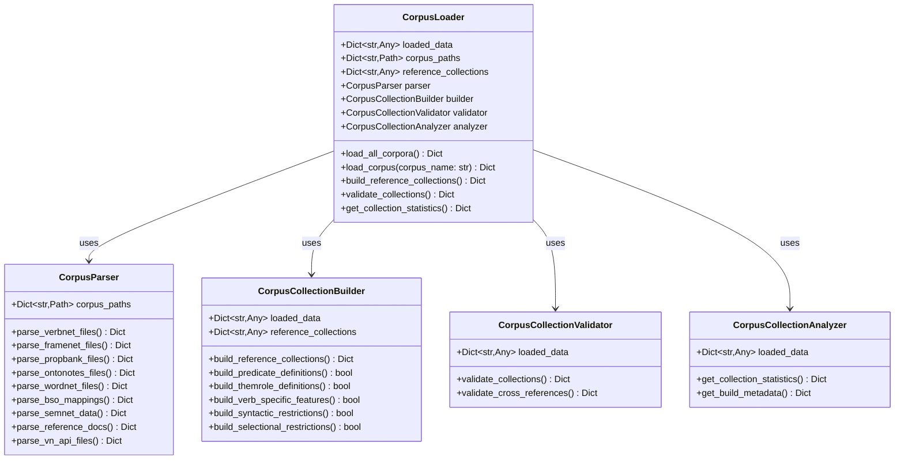

# Corpus Loader Module

The `corpus_loader` module provides comprehensive corpus loading, parsing, validation, and analysis capabilities for the UVI package. It handles multiple linguistic resources including VerbNet, FrameNet, PropBank, OntoNotes, WordNet, BSO, SemNet, and reference documentation.

## Overview

This module manages the entire pipeline from raw corpus files to structured, validated linguistic data collections. It automatically detects corpus locations, parses different file formats, validates data integrity, and builds cross-corpus reference collections.

## Architecture



## Key Classes

### CorpusLoader

The main orchestrator class that coordinates all corpus loading operations.

**Primary Responsibilities:**
- Auto-detect corpus file locations
- Coordinate parsing across multiple corpus types
- Manage component initialization and lifecycle
- Provide unified interface for corpus operations

**Key Methods:**
- `load_all_corpora()` - Load all available corpus data
- `load_corpus(corpus_name)` - Load specific corpus by name
- `get_corpus_paths()` - Get detected corpus locations
- `build_reference_collections()` - Build cross-corpus reference data

### CorpusParser

Specialized parser for different linguistic corpus formats.

**Supported Formats:**
- VerbNet XML files with class hierarchies and frame structures
- FrameNet XML with frame definitions and lexical units
- PropBank XML with predicate-argument structures
- OntoNotes sense inventory files
- WordNet data, index, and exception files
- BSO CSV mapping files
- SemNet JSON semantic networks
- Reference documentation (JSON/TSV)

### CorpusCollectionBuilder

Builds reference collections from loaded corpus data.

**Collection Types:**
- Predicate definitions from reference docs
- Thematic role definitions
- Verb-specific semantic features
- Syntactic restrictions from VerbNet frames
- Selectional restrictions from thematic roles

### CorpusCollectionValidator

Validates corpus data integrity and cross-references.

**Validation Features:**
- Collection completeness checks
- Cross-corpus reference validation
- Data structure integrity verification
- Missing data detection and warnings

## Usage Examples

### Basic Usage

```python
from uvi.corpus_loader import CorpusLoader

# Initialize with default corpus directory
loader = CorpusLoader('path/to/corpora/')

# Load all available corpora
results = loader.load_all_corpora()

# Access loaded data
verbnet_data = loader.loaded_data.get('verbnet', {})
framenet_data = loader.loaded_data.get('framenet', {})

# Build reference collections
loader.build_reference_collections()
predicates = loader.reference_collections.get('predicates', {})
```

### Loading Specific Corpora

```python
# Load only VerbNet data
try:
    verbnet_data = loader.load_corpus('verbnet')
    print(f"Loaded {len(verbnet_data['classes'])} VerbNet classes")
except FileNotFoundError:
    print("VerbNet corpus not found")

# Load PropBank with error handling
propbank_data = loader.load_corpus('propbank')
if propbank_data:
    print(f"Loaded {len(propbank_data['predicates'])} PropBank predicates")
```

### Validation and Analysis

```python
# Validate all collections
validation_results = loader.validate_collections()
for corpus, result in validation_results.items():
    if result['status'] == 'invalid':
        print(f"Validation errors in {corpus}: {result['errors']}")

# Get collection statistics
stats = loader.get_collection_statistics()
print(f"Total statistics: {stats}")

# Get build metadata
metadata = loader.get_build_metadata()
print(f"Build information: {metadata}")
```

## Supported Corpora

| Corpus | Format | Key Data |
|--------|---------|----------|
| VerbNet | XML | Classes, frames, thematic roles, members |
| FrameNet | XML | Frames, lexical units, frame elements |
| PropBank | XML | Predicates, rolesets, argument structures |
| OntoNotes | XML | Sense inventories, cross-corpus mappings |
| WordNet | Text | Synsets, indices, morphological exceptions |
| BSO | CSV | VerbNet-to-BSO category mappings |
| SemNet | JSON | Semantic networks for verbs and nouns |
| Reference Docs | JSON/TSV | Predicate definitions, constants |

## Configuration

The loader automatically detects corpus directories using common naming patterns:

```python
corpus_mappings = {
    'verbnet': ['verbnet', 'vn', 'verbnet3.4'],
    'framenet': ['framenet', 'fn', 'framenet1.7'],
    'propbank': ['propbank', 'pb', 'propbank3.4'],
    'ontonotes': ['ontonotes', 'on', 'ontonotes5.0'],
    'wordnet': ['wordnet', 'wn', 'wordnet3.1'],
    'bso': ['BSO', 'bso', 'basic_semantic_ontology'],
    'semnet': ['semnet20180205', 'semnet', 'semantic_network'],
    'reference_docs': ['reference_docs', 'ref_docs', 'docs'],
    'vn_api': ['vn_api', 'verbnet_api', 'vn']
}
```

## Integration Guidelines

1. **Start with auto-detection**: Place your corpus directories in the expected locations
2. **Use the main CorpusLoader class**: It handles all the complexity internally
3. **Check loading results**: Always verify which corpora were successfully loaded
4. **Build collections after loading**: Use `build_reference_collections()` for cross-corpus features
5. **Validate your data**: Run validation to ensure data integrity

### Error Handling

The module provides comprehensive error handling:

```python
# Loading results include status information
loading_results = loader.load_all_corpora()
for corpus, result in loading_results.items():
    if result['status'] == 'error':
        print(f"Failed to load {corpus}: {result['error']}")
    elif result['status'] == 'not_found':
        print(f"Corpus {corpus} not found in search paths")
```

### Performance Considerations

- Large corpora (like WordNet) may take time to load
- Reference collection building is performed after all loading
- Validation can be run independently of loading
- Use specific corpus loading for better performance when only subset needed