# Graph Module

The `graph` module provides specialized NetworkX graph builders for constructing semantic networks from various linguistic corpora. Each builder transforms linguistic data into structured graph representations with hierarchical relationships and semantic connections.

## Overview

This module enables visualization and analysis of linguistic resources through graph-based representations. It provides a common framework for building semantic networks that preserve the hierarchical and relational structure of different linguistic corpora while making them accessible for network analysis and visualization.

## Architecture

```mermaid
classDiagram
    class GraphBuilder {
        +calculate_node_depths(G, hierarchy, root_nodes)
        +display_graph_statistics(G, hierarchy, custom_stats)
        +create_hierarchy_entry(parents, children, depth, info)
        +add_node_with_hierarchy(G, hierarchy, node_name, node_type, parents, info)
        +connect_nodes(G, hierarchy, parent, child)
        +get_node_counts_by_type(G, type_attribute)
        #_display_node_info(node, hierarchy)
    }

    class FrameNetGraphBuilder {
        +create_framenet_graph(data, num_frames, max_lus, max_fes)
        #_select_frames_with_content(frames_data, num_frames)
        #_add_frames_to_graph(G, hierarchy, frames_data, selected_frames)
        #_add_lexical_units_to_graph(G, hierarchy, frames_data, selected_frames, max_lus)
        #_add_frame_elements_to_graph(G, hierarchy, frames_data, selected_frames, max_fes)
        #_create_frame_connections(G, hierarchy, selected_frames)
    }

    class PropBankGraphBuilder {
        +create_propbank_graph(data, num_predicates, max_rolesets, max_roles, max_examples, include_aliases)
        #_select_predicates_with_content(predicates_data, num_predicates)
        #_add_predicates_to_graph(G, hierarchy, predicates_data, selected_predicates)
        #_add_rolesets_to_graph(G, hierarchy, predicates_data, selected_predicates, max_rolesets)
        #_add_roles_to_graph(G, hierarchy, predicates_data, selected_predicates, max_roles)
        #_add_examples_to_graph(G, hierarchy, predicates_data, selected_predicates, max_examples)
        #_add_aliases_to_graph(G, hierarchy, predicates_data, selected_predicates)
    }

    class VerbNetGraphBuilder {
        +create_verbnet_graph(data, num_classes, max_subclasses, include_members, max_members)
        #_get_class_members(class_data, max_members)
        #_get_class_frames(class_data)
        #_get_class_themroles(class_data)
        #_get_subclasses(class_data, max_subclasses)
        #_add_semantic_connections(G, hierarchy, root_nodes, vn_classes)
    }

    class WordNetGraphBuilder {
        +create_wordnet_graph(data, pos_filter, max_synsets, max_depth)
        #_select_synsets_by_pos(wordnet_data, pos_filter, max_synsets)
        #_add_synsets_to_graph(G, hierarchy, synsets_data, selected_synsets)
        #_create_semantic_relations(G, hierarchy, selected_synsets)
    }

    GraphBuilder <|-- FrameNetGraphBuilder
    GraphBuilder <|-- PropBankGraphBuilder  
    GraphBuilder <|-- VerbNetGraphBuilder
    GraphBuilder <|-- WordNetGraphBuilder
```



## Key Classes

### GraphBuilder (Base Class)

The foundational class providing common graph construction utilities.

**Core Functionality:**
- **Hierarchical node management**: Creates consistent hierarchy structures across all graph types
- **Depth calculation**: Uses BFS to calculate node depths from root nodes
- **Node connection utilities**: Manages both graph edges and hierarchy relationships
- **Statistics and display**: Provides standardized graph analysis and reporting

### FrameNetGraphBuilder

Constructs semantic graphs from FrameNet frame data.

**Node Types:**
- **Frame nodes**: Core semantic frames with definitions and relationships
- **Lexical Unit nodes**: Words that evoke frames, with part-of-speech information
- **Frame Element nodes**: Semantic roles within frames (Agent, Theme, etc.)

**Key Features:**
- Frame hierarchy preservation
- Lexical unit attachment to frames
- Frame element relationships
- Cross-frame semantic connections

### PropBankGraphBuilder

Builds predicate-argument structure graphs from PropBank data.

**Node Types:**
- **Predicate nodes**: Root predicates with lemma information
- **Roleset nodes**: Specific senses of predicates with argument structures
- **Role nodes**: Numbered arguments (Arg0, Arg1, etc.) with descriptions
- **Example nodes**: Annotated usage examples
- **Alias nodes**: Alternative forms and expressions

**Key Features:**
- Multi-level argument structure representation
- Example sentence integration
- Cross-predicate semantic relationships
- Alias and variant handling

### VerbNetGraphBuilder

Creates verb class hierarchy graphs from VerbNet data.

**Node Types:**
- **Verb Class nodes**: Top-level semantic verb classes
- **Verb Subclass nodes**: Specialized subclasses with refined semantics
- **Verb Member nodes**: Individual verbs belonging to classes

**Key Features:**
- Class hierarchy preservation
- Member verb distribution
- Thematic role integration
- Semantic frame representation

### WordNetGraphBuilder

Constructs semantic networks from WordNet synset relationships.

**Node Types:**
- **Synset nodes**: Synonym sets representing concepts
- **Category nodes**: Higher-level semantic categories

**Key Features:**
- Hypernym/hyponym relationships
- Part-of-speech filtering
- Depth-limited hierarchies
- Cross-category connections

## Usage Examples

### Basic FrameNet Graph Construction

```python
from uvi.graph import FrameNetGraphBuilder

# Load FrameNet data (assumed loaded)
builder = FrameNetGraphBuilder()

# Create graph with 5 frames, up to 3 lexical units and frame elements each
graph, hierarchy = builder.create_framenet_graph(
    framenet_data,
    num_frames=5,
    max_lus_per_frame=3,
    max_fes_per_frame=3
)

print(f"Created graph with {graph.number_of_nodes()} nodes and {graph.number_of_edges()} edges")
```

### PropBank Predicate Network

```python
from uvi.graph import PropBankGraphBuilder

builder = PropBankGraphBuilder()

# Build comprehensive predicate-argument graph
graph, hierarchy = builder.create_propbank_graph(
    propbank_data,
    num_predicates=6,
    max_rolesets_per_predicate=2,
    max_roles_per_roleset=4,
    max_examples_per_roleset=2,
    include_aliases=True
)

# Analyze node types
node_types = builder.get_node_counts_by_type(graph)
print(f"Node distribution: {node_types}")
```

### VerbNet Class Hierarchy

```python
from uvi.graph import VerbNetGraphBuilder

builder = VerbNetGraphBuilder()

# Create verb class network with member verbs
graph, hierarchy = builder.create_verbnet_graph(
    verbnet_data,
    num_classes=8,
    max_subclasses_per_class=4,
    include_members=True,
    max_members_per_class=3
)

# Access hierarchy information
for node_name, node_info in hierarchy.items():
    depth = node_info.get('depth', 0)
    children = len(node_info.get('children', []))
    print(f"{node_name}: depth={depth}, children={children}")
```

### Multi-Corpus Analysis

```python
# Create graphs from multiple corpora
fn_builder = FrameNetGraphBuilder()
pb_builder = PropBankGraphBuilder()
vn_builder = VerbNetGraphBuilder()

fn_graph, fn_hierarchy = fn_builder.create_framenet_graph(framenet_data)
pb_graph, pb_hierarchy = pb_builder.create_propbank_graph(propbank_data) 
vn_graph, vn_hierarchy = vn_builder.create_verbnet_graph(verbnet_data)

# Compare graph structures
print(f"FrameNet: {fn_graph.number_of_nodes()} nodes")
print(f"PropBank: {pb_graph.number_of_nodes()} nodes")
print(f"VerbNet: {vn_graph.number_of_nodes()} nodes")
```

## Graph Structure

### Standard Node Attributes

All graph builders create nodes with consistent attributes:

```python
# Node attributes
{
    'node_type': 'frame|predicate|verb_class|synset|...',
    'depth': 0,  # Distance from root nodes
    # Type-specific attributes
}
```

### Hierarchy Dictionary Format

```python
hierarchy = {
    'node_name': {
        'parents': ['parent1', 'parent2'],
        'children': ['child1', 'child2'], 
        'depth': 2,
        'frame_info': {  # or predicate_info, synset_info, etc.
            'node_type': 'frame',
            'definition': '...',
            'elements': 5,
            'lexical_units': 12
        }
    }
}
```

### Supported Node Types

| Builder | Node Types | Description |
|---------|------------|-------------|
| FrameNet | `frame`, `lexical_unit`, `frame_element` | Frames and their components |
| PropBank | `predicate`, `roleset`, `role`, `example`, `alias` | Predicates and argument structures |
| VerbNet | `verb_class`, `verb_subclass`, `verb_member` | Verb classes and members |
| WordNet | `synset`, `category` | Synonym sets and categories |

## Integration Guidelines

### For Novice Users

1. **Start with small graphs**: Use the default parameters to create manageable graph sizes
2. **Understand the hierarchy**: Each builder returns both a NetworkX graph and a hierarchy dictionary
3. **Use built-in statistics**: Call the display methods to understand graph structure
4. **Leverage node types**: Filter and analyze nodes by their type attributes

### Graph Analysis Patterns

```python
# Common analysis patterns
def analyze_graph_depth(hierarchy):
    depth_distribution = {}
    for node_data in hierarchy.values():
        depth = node_data.get('depth', 0)
        depth_distribution[depth] = depth_distribution.get(depth, 0) + 1
    return depth_distribution

def find_leaf_nodes(hierarchy):
    return [node for node, data in hierarchy.items() 
            if not data.get('children', [])]

def get_root_nodes(hierarchy):
    return [node for node, data in hierarchy.items() 
            if not data.get('parents', [])]
```

### Performance Considerations

- **Memory usage**: Large corpora can create extensive graphs; use size limits appropriately
- **Computation time**: Depth calculation is O(V+E) where V=nodes, E=edges
- **Graph complexity**: Balance detail level with visualization and analysis requirements

## Data Processing Features

### Automatic Content Selection

All builders implement intelligent content selection:
- **Quality filtering**: Selects nodes with meaningful content (e.g., frames with lexical units)
- **Balanced sampling**: Distributes selections across different categories
- **Size limiting**: Respects maximum node/edge limits for manageable graphs

### Error Handling

Robust error handling throughout:
- **Missing data**: Graceful handling of incomplete corpus data
- **Type validation**: Safe processing of different data formats
- **Logging**: Comprehensive warning and error reporting

### Extensibility

The base `GraphBuilder` class provides extension points:
- **Custom node types**: Override `_display_node_info()` for specialized display
- **Custom connections**: Implement domain-specific relationship logic
- **Custom statistics**: Add builder-specific metrics and analysis

This module provides the foundation for semantic network analysis across multiple linguistic resources, enabling researchers to visualize, analyze, and understand the complex relationships within and between different linguistic corpora.