# Parsers Module

The `parsers` module provides specialized parsers for nine different linguistic corpora formats. Each parser handles the unique file formats, data structures, and namespace requirements of its respective corpus, transforming raw linguistic data into standardized Python dictionaries.

## Overview

This module bridges the gap between heterogeneous corpus file formats and unified data structures. Each parser is optimized for its specific corpus format while maintaining consistent output interfaces, enabling seamless integration across multiple linguistic resources.

## Architecture

```mermaid
classDiagram
    class VerbNetParser {
        +Path corpus_path
        +Path schema_path
        +parse_all_classes() Dict
        +parse_class_file(file_path) Dict
        #_parse_vnclass_element(class_element) Dict
        #_parse_members(members_element) List
        #_parse_frames(frames_element) List
        #_parse_themroles(themroles_element) List
        #_index_members(class_data, members_index)
        #_build_class_hierarchy(classes) Dict
    }

    class FrameNetParser {
        +Path corpus_path
        +Path frame_dir
        +Dict NAMESPACES
        +parse_all_frames() Dict
        +parse_frame_file(file_path) Dict
        +parse_frame_relations(relations_file) Dict
        #_strip_namespace(tag) str
        #_find_element(parent, tag) Element
        #_parse_frame_element(frame_element) Dict
        #_parse_lexical_units(frame_element) Dict
        #_parse_frame_elements(frame_element) Dict
    }

    class PropBankParser {
        +Path corpus_path
        +parse_all_frames() Dict
        +parse_predicate_file(file_path) Dict
        #_parse_frameset_element(frameset_element) Dict
        #_parse_predicate_element(predicate_element) Dict
        #_parse_roleset_element(roleset_element) Dict
        #_parse_role_element(role_element) Dict
        #_parse_example_element(example_element) Dict
    }

    class WordNetParser {
        +Path corpus_path
        +Dict data_files
        +Dict index_files
        +Dict exception_files
        +Dict relation_types
        +parse_all_data() Dict
        +parse_data_file(pos, data_file) Dict
        +parse_index_file(pos, index_file) Dict
        +parse_exception_file(pos, exc_file) Dict
        #_parse_synset_line(line) Dict
        #_parse_index_entry(line) Dict
        #_parse_pointer(pointer_str) Dict
    }

    class OntoNotesParser {
        +Path corpus_path
        +parse_all_senses() Dict
        +parse_sense_file(file_path) Dict
        #_parse_inventory_element(inventory_element) Dict
        #_parse_sense_element(sense_element) Dict
        #_parse_mappings_element(mappings_element) Dict
    }

    class BSOParser {
        +Path corpus_path
        +parse_all_mappings() Dict
        +parse_mapping_file(file_path) List
        #_parse_csv_file(file_path, delimiter) List
        #_process_mapping_row(row) Dict
    }

    class SemNetParser {
        +Path corpus_path
        +parse_all_networks() Dict
        +parse_network_file(file_path) Dict
        #_parse_json_file(file_path) Dict
        #_process_network_data(data) Dict
    }

    class ReferenceParser {
        +Path corpus_path
        +parse_all_references() Dict
        +parse_predicate_definitions(file_path) Dict
        +parse_themrole_definitions(file_path) Dict
        +parse_constants(file_path) Dict
        #_parse_json_file(file_path) Dict
        #_parse_tsv_file(file_path) List
    }

    class VNAPIParser {
        +Path corpus_path
        +parse_enhanced_classes() Dict
        #_enhance_class_data(class_data) Dict
        #_add_api_metadata(data) Dict
    }
```



## Key Classes

### VerbNetParser

Handles VerbNet's XML format with complex hierarchical class structures.

**Key Features:**
- **Class hierarchy parsing**: Extracts main classes and subclasses with parent-child relationships
- **Member indexing**: Builds reverse index from verbs to their classes
- **Frame structure extraction**: Parses syntactic and semantic frame information
- **Thematic role processing**: Handles selectional and syntactic restrictions
- **XML validation**: Optional lxml validation against VerbNet schema

### FrameNetParser

Manages FrameNet's namespace-aware XML format.

**Key Features:**
- **Namespace handling**: Robust processing of XML namespaces
- **Frame relationship parsing**: Extracts frame-to-frame semantic relationships
- **Lexical unit processing**: Handles word-frame associations with POS information
- **Frame element extraction**: Parses semantic roles and their properties
- **Multi-file coordination**: Integrates frame index, relations, and individual frame files

### PropBankParser

Processes PropBank's predicate-argument structure XML files.

**Key Features:**
- **Predicate frame parsing**: Extracts verb sense information and argument structures
- **Roleset processing**: Handles multiple senses per predicate
- **Argument annotation**: Parses numbered arguments (Arg0, Arg1, etc.) with descriptions
- **Example integration**: Includes annotated example sentences
- **Cross-reference support**: Maintains VerbNet class references

### WordNetParser

Handles WordNet's custom text-based format across multiple file types.

**Key Features:**
- **Multi-file processing**: Handles data files, indices, and exception lists
- **Synset parsing**: Extracts synonym sets with definitions and relationships
- **Pointer resolution**: Processes semantic relationships (hypernyms, meronyms, etc.)
- **POS-specific handling**: Separate processing for nouns, verbs, adjectives, adverbs
- **Exception handling**: Manages irregular morphological forms

### OntoNotesParser

Processes OntoNotes sense inventory XML files with cross-corpus mappings.

**Key Features:**
- **Sense inventory parsing**: Extracts word senses with definitions
- **Cross-corpus mapping**: Handles mappings to WordNet, VerbNet, PropBank
- **Example processing**: Includes sense-specific usage examples
- **Grouping support**: Manages sense groupings and hierarchies

### BSOParser (Basic Semantic Ontology)

Handles CSV-based semantic category mappings.

**Key Features:**
- **CSV processing**: Flexible delimiter handling for different CSV formats
- **Mapping extraction**: Builds bidirectional VerbNet-BSO category mappings
- **Category hierarchies**: Processes semantic category relationships
- **Member association**: Links BSO categories to VerbNet class members

### SemNetParser

Processes JSON-based semantic network files.

**Key Features:**
- **JSON parsing**: Handles large semantic network JSON files
- **Network structure**: Extracts nodes and edges from semantic networks
- **Multi-network support**: Processes separate verb and noun networks
- **Relationship processing**: Handles various semantic relationship types

### ReferenceParser

Manages reference documentation in JSON and TSV formats.

**Key Features:**
- **Multi-format support**: Handles both JSON and TSV reference files
- **Predicate definitions**: Extracts semantic predicate definitions
- **Thematic role definitions**: Processes role type descriptions
- **Constants parsing**: Handles VerbNet constants and features
- **Cross-format integration**: Combines data from multiple reference sources

### VNAPIParser

Enhanced VerbNet parser with API-specific features.

**Key Features:**
- **Enhanced parsing**: Extends VerbNet parser with API-specific metadata
- **Version tracking**: Adds API version information
- **Feature flagging**: Marks enhanced features and capabilities
- **Backward compatibility**: Maintains compatibility with standard VerbNet format

## Usage Examples

### Basic VerbNet Parsing

```python
from uvi.parsers import VerbNetParser
from pathlib import Path

# Initialize parser with corpus path
parser = VerbNetParser(Path('corpora/verbnet3.4/'))

# Parse all VerbNet classes
verbnet_data = parser.parse_all_classes()

# Access parsed data
classes = verbnet_data['classes']
hierarchy = verbnet_data['hierarchy']
members_index = verbnet_data['members_index']

print(f"Parsed {len(classes)} VerbNet classes")
print(f"Member index contains {len(members_index)} verbs")
```

### FrameNet Frame Analysis

```python
from uvi.parsers import FrameNetParser

parser = FrameNetParser(Path('corpora/framenet1.7/'))

# Parse all frames
framenet_data = parser.parse_all_frames()

# Analyze frame structure
frames = framenet_data['frames']
for frame_name, frame_data in frames.items():
    lexical_units = len(frame_data.get('lexical_units', {}))
    frame_elements = len(frame_data.get('frame_elements', {}))
    print(f"{frame_name}: {lexical_units} LUs, {frame_elements} FEs")
```

### Multi-Format PropBank Processing

```python
from uvi.parsers import PropBankParser

parser = PropBankParser(Path('corpora/propbank3.4/frames/'))

# Parse predicate frames
propbank_data = parser.parse_all_frames()

# Examine argument structures
predicates = propbank_data['predicates']
for lemma, predicate_data in predicates.items():
    rolesets = len(predicate_data.get('rolesets', []))
    print(f"Predicate '{lemma}': {rolesets} senses")
    
    # Analyze rolesets
    for roleset in predicate_data['rolesets']:
        roles = len(roleset.get('roles', []))
        examples = len(roleset.get('examples', []))
        print(f"  Roleset {roleset.get('id', 'unknown')}: {roles} roles, {examples} examples")
```

### WordNet Comprehensive Parsing

```python
from uvi.parsers import WordNetParser

parser = WordNetParser(Path('corpora/wordnet3.1/'))

# Parse all WordNet data
wordnet_data = parser.parse_all_data()

# Access different data types
synsets = wordnet_data['synsets']
indices = wordnet_data['index']  
exceptions = wordnet_data['exceptions']

# Analyze by part-of-speech
for pos in ['noun', 'verb', 'adj', 'adv']:
    pos_synsets = len(synsets.get(pos, {}))
    pos_indices = len(indices.get(pos, {}))
    pos_exceptions = len(exceptions.get(pos, {}))
    print(f"{pos}: {pos_synsets} synsets, {pos_indices} indices, {pos_exceptions} exceptions")
```

### Cross-Corpus Reference Processing

```python
from uvi.parsers import ReferenceParser, OntoNotesParser

# Parse reference definitions
ref_parser = ReferenceParser(Path('corpora/reference_docs/'))
ref_data = ref_parser.parse_all_references()

predicates = ref_data['predicates']
themroles = ref_data['themroles']
constants = ref_data['constants']

# Parse OntoNotes mappings  
on_parser = OntoNotesParser(Path('corpora/ontonotes5.0/'))
on_data = on_parser.parse_all_senses()

# Cross-reference analysis
for lemma, inventory in on_data['sense_inventories'].items():
    for sense in inventory.get('senses', []):
        mappings = sense.get('mappings', {})
        vn_mapping = mappings.get('vn', '')
        pb_mapping = mappings.get('pb', '')
        print(f"{lemma} sense {sense.get('n', '')}: VN={vn_mapping}, PB={pb_mapping}")
```

## File Format Support

| Parser | Input Formats | Key Elements | Special Features |
|---------|---------------|--------------|------------------|
| VerbNet | XML | Classes, frames, members, roles | Hierarchical structure, schema validation |
| FrameNet | XML | Frames, lexical units, elements, relations | Namespace handling, multi-file integration |
| PropBank | XML | Predicates, rolesets, roles, examples | Argument structure, cross-references |
| WordNet | Text | Synsets, indices, exceptions | Custom format, pointer relationships |
| OntoNotes | XML | Sense inventories, mappings | Cross-corpus links, sense groupings |
| BSO | CSV | Category mappings | Flexible delimiters, bidirectional maps |
| SemNet | JSON | Semantic networks | Large network structures, node/edge data |
| Reference | JSON/TSV | Definitions, constants | Multi-format, cross-references |
| VN API | XML | Enhanced classes | API metadata, version tracking |

## Error Handling and Robustness

### Common Error Scenarios

All parsers implement comprehensive error handling:

```python
# Example error handling patterns
try:
    parser = VerbNetParser(Path('invalid/path/'))
    data = parser.parse_all_classes()
    if not data['classes']:
        print("Warning: No classes found - check corpus path")
except Exception as e:
    print(f"Parsing error: {e}")
    # Graceful degradation with empty structure
    data = {'classes': {}, 'hierarchy': {}, 'members_index': {}}
```

### Validation Features

- **Path validation**: Checks for corpus directory existence
- **Format validation**: Validates XML structure and required elements  
- **Content validation**: Ensures required fields and data consistency
- **Schema validation**: Optional XSD validation for XML formats
- **Encoding handling**: Robust UTF-8 processing across all formats

## Integration Guidelines

### For Novice Users

1. **Start with existing corpora**: Use standard corpus directory structures
2. **Check file paths**: Verify corpus files exist before parsing
3. **Handle parsing errors**: Always wrap parser calls in try-catch blocks
4. **Validate output**: Check for empty results and missing data
5. **Use consistent naming**: Follow corpus-standard file naming conventions

### Performance Optimization

```python
# Efficient parsing patterns
from concurrent.futures import ThreadPoolExecutor
from uvi.parsers import VerbNetParser, FrameNetParser

def parallel_parsing():
    parsers = [
        ('verbnet', VerbNetParser(Path('corpora/verbnet/'))),
        ('framenet', FrameNetParser(Path('corpora/framenet/')))
    ]
    
    results = {}
    with ThreadPoolExecutor(max_workers=2) as executor:
        futures = {
            executor.submit(parser.parse_all_classes if name == 'verbnet' 
                          else parser.parse_all_frames): name 
            for name, parser in parsers
        }
        
        for future, name in futures.items():
            results[name] = future.result()
    
    return results
```

### Memory Management

- **Streaming processing**: Large files processed in chunks where possible
- **Lazy loading**: Optional delayed parsing for memory-constrained environments
- **Garbage collection**: Explicit cleanup for large corpus processing
- **Memory monitoring**: Built-in memory usage tracking for large operations

## Data Structure Standardization

### Common Output Format

All parsers produce consistent dictionary structures:

```python
# Standard parser output format
{
    'main_data_key': {  # 'classes', 'frames', 'predicates', 'synsets', etc.
        'item_id': {
            'id': 'item_id',
            'type': 'item_type', 
            'attributes': {...},
            'relationships': {...},
            'metadata': {...}
        }
    },
    'hierarchy': {...},      # Optional hierarchical relationships
    'statistics': {...},     # Parsing statistics and metadata  
    'cross_references': {...} # Optional cross-corpus references
}
```

This standardized approach ensures seamless integration across the UVI package while preserving the unique characteristics and relationships within each linguistic corpus.