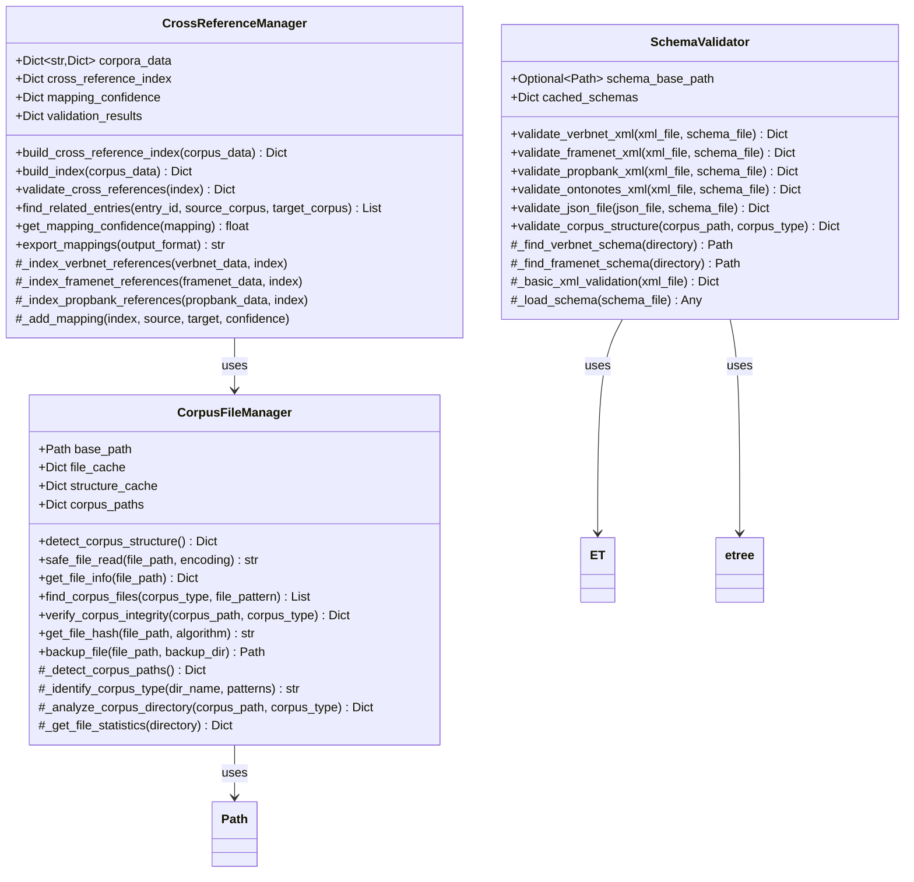

# Utils Module

The `utils` module provides essential utility functions and classes for the UVI (Unified Verb Index) package. This module serves as the foundation for corpus file management, schema validation, and cross-corpus reference handling across all nine supported linguistic resources.

## Overview

The utils module implements critical infrastructure components that support all other UVI modules. It provides robust, reusable utilities for file operations, data validation, and cross-corpus relationship management, ensuring consistent and reliable operation across different linguistic resources.

## Architecture



## Key Classes

### SchemaValidator

Provides comprehensive validation for corpus files against their schemas.

**Primary Responsibilities:**
- **XML Schema Validation**: Supports DTD and XSD validation for XML corpus files
- **JSON Schema Validation**: Validates JSON files against schema specifications  
- **Corpus-Specific Validation**: Tailored validation for each supported corpus format
- **Structure Validation**: Verifies corpus directory and file organization

**Key Methods:**
- `validate_verbnet_xml()` - VerbNet XML validation against DTD/XSD
- `validate_framenet_xml()` - FrameNet XML validation with namespace handling
- `validate_propbank_xml()` - PropBank XML validation
- `validate_json_file()` - JSON validation against schema
- `validate_corpus_structure()` - Directory structure validation

### CrossReferenceManager

Manages relationships and mappings between different linguistic corpora.

**Primary Responsibilities:**
- **Reference Index Building**: Creates comprehensive cross-corpus mapping indices
- **Validation**: Ensures cross-reference integrity and consistency
- **Query Interface**: Provides methods to find related entries across corpora
- **Confidence Scoring**: Assigns reliability scores to cross-corpus mappings

**Key Methods:**
- `build_cross_reference_index()` - Build comprehensive mapping index
- `validate_cross_references()` - Validate mapping consistency
- `find_related_entries()` - Query related entries across corpora
- `get_mapping_confidence()` - Get confidence score for mappings
- `export_mappings()` - Export mappings in various formats

### CorpusFileManager

Handles file system operations and corpus directory management.

**Primary Responsibilities:**
- **Safe File Operations**: Robust file reading with encoding detection
- **Directory Structure Detection**: Automatic corpus directory identification
- **File System Monitoring**: Track file changes and integrity
- **Backup and Recovery**: File backup and recovery operations

**Key Methods:**
- `detect_corpus_structure()` - Analyze corpus directory structure
- `safe_file_read()` - Safe file reading with error handling
- `get_file_info()` - Comprehensive file metadata extraction
- `find_corpus_files()` - Locate files by corpus type and pattern
- `verify_corpus_integrity()` - Check corpus file integrity

## Usage Examples

### Basic Schema Validation

```python
from uvi.utils import SchemaValidator
from pathlib import Path

# Initialize validator
validator = SchemaValidator(Path('schemas/'))

# Validate VerbNet XML file
result = validator.validate_verbnet_xml(
    Path('corpora/verbnet/accept-77.xml')
)

if result['valid']:
    print("VerbNet file is valid")
else:
    print(f"Validation error: {result['error']}")
    for warning in result['warnings']:
        print(f"Warning: {warning}")
```

### Cross-Reference Management

```python
from uvi.utils import CrossReferenceManager

# Initialize with loaded corpus data
manager = CrossReferenceManager(corpus_data)

# Build comprehensive cross-reference index
cross_ref_index = manager.build_cross_reference_index()

# Find related entries
related = manager.find_related_entries(
    'accept-77', 
    source_corpus='verbnet', 
    target_corpus='propbank'
)

print(f"Found {len(related)} related PropBank entries")
for entry in related:
    confidence = manager.get_mapping_confidence(entry)
    print(f"  {entry}: confidence={confidence}")
```

### Corpus File Management

```python
from uvi.utils import CorpusFileManager
from pathlib import Path

# Initialize file manager
manager = CorpusFileManager(Path('corpora/'))

# Detect corpus structure
structure = manager.detect_corpus_structure()

print(f"Detected {len(structure['detected_corpora'])} corpora")
for corpus_type, info in structure['detected_corpora'].items():
    print(f"  {corpus_type}: {info['file_count']} files at {info['path']}")

# Safe file reading
content = manager.safe_file_read(Path('corpora/verbnet/accept-77.xml'))
if content:
    print(f"Successfully read file: {len(content)} characters")
```

### Advanced Cross-Reference Validation

```python
# Comprehensive validation workflow
validator = SchemaValidator()
cross_ref_manager = CrossReferenceManager()
file_manager = CorpusFileManager(Path('corpora/'))

# Step 1: Validate corpus structure
structure = file_manager.detect_corpus_structure()

# Step 2: Validate individual files
validation_results = {}
for corpus_type, info in structure['detected_corpora'].items():
    corpus_files = file_manager.find_corpus_files(corpus_type, '*.xml')
    
    for file_path in corpus_files[:5]:  # Validate first 5 files
        if corpus_type == 'verbnet':
            result = validator.validate_verbnet_xml(file_path)
        elif corpus_type == 'framenet':
            result = validator.validate_framenet_xml(file_path)
        elif corpus_type == 'propbank':
            result = validator.validate_propbank_xml(file_path)
        
        validation_results[str(file_path)] = result

# Step 3: Build and validate cross-references
cross_ref_index = cross_ref_manager.build_cross_reference_index(corpus_data)
cross_ref_validation = cross_ref_manager.validate_cross_references(cross_ref_index)

print(f"Validation complete:")
print(f"  Files validated: {len(validation_results)}")
print(f"  Cross-references built: {len(cross_ref_index)}")
print(f"  Cross-reference validation: {cross_ref_validation['status']}")
```

## Supported Corpus Validations

| Corpus | File Format | Schema Type | Special Features |
|---------|-------------|-------------|------------------|
| VerbNet | XML | DTD/XSD | Class hierarchy validation, member verification |
| FrameNet | XML | DTD | Namespace handling, frame relationship validation |
| PropBank | XML | XSD | Roleset validation, argument structure checking |
| OntoNotes | XML | XSD | Sense inventory validation, mapping verification |
| WordNet | Text | Custom | Line format validation, pointer consistency |
| BSO | CSV | Custom | Header validation, mapping consistency |
| SemNet | JSON | JSON Schema | Network structure validation |
| Reference Docs | JSON/TSV | Multiple | Multi-format validation |
| VN API | XML | Extended XSD | Enhanced VerbNet validation |

## Cross-Reference Mapping Types

### Supported Mappings

The CrossReferenceManager supports the following cross-corpus relationships:

```python
mapping_types = {
    'verbnet_to_propbank': 'VerbNet class → PropBank predicate',
    'propbank_to_verbnet': 'PropBank predicate → VerbNet class', 
    'verbnet_to_framenet': 'VerbNet class → FrameNet frame',
    'framenet_to_verbnet': 'FrameNet frame → VerbNet class',
    'propbank_to_framenet': 'PropBank predicate → FrameNet frame',
    'framenet_to_propbank': 'FrameNet frame → PropBank predicate',
    'wordnet_mappings': 'WordNet synset cross-references',
    'ontonotes_mappings': 'OntoNotes sense mappings'
}
```

### Confidence Scoring

Mappings are assigned confidence scores based on:

- **Direct references**: Score 0.9-1.0 for explicit cross-corpus references
- **Shared members**: Score 0.7-0.9 for classes with common member verbs
- **Semantic similarity**: Score 0.5-0.8 for computationally derived relationships
- **Manual validation**: Score 1.0 for manually verified mappings

## Integration Guidelines

### For Novice Users

1. **Start with structure detection**: Use `CorpusFileManager.detect_corpus_structure()` to verify setup
2. **Validate before processing**: Always validate files before parsing
3. **Handle validation errors**: Check validation results and handle errors gracefully
4. **Use safe file operations**: Prefer `safe_file_read()` over direct file operations
5. **Cache validation results**: Reuse validation results when processing multiple files

### Error Handling Best Practices

```python
from uvi.utils import SchemaValidator, safe_file_read

def robust_corpus_processing():
    validator = SchemaValidator()
    
    try:
        # Safe file reading with error handling
        content = safe_file_read(Path('corpus_file.xml'), encoding='utf-8')
        if not content:
            print("Warning: Empty or unreadable file")
            return None
        
        # Validation with error handling
        validation_result = validator.validate_verbnet_xml(Path('corpus_file.xml'))
        
        if validation_result['valid'] is False:
            print(f"Validation failed: {validation_result['error']}")
            return None
        elif validation_result['valid'] is None:
            print("Warning: Could not validate - proceeding with caution")
        
        # Process validated content
        return process_content(content)
        
    except Exception as e:
        print(f"Processing error: {e}")
        return None
```

### Performance Considerations

- **Schema caching**: Schemas are cached to avoid repeated loading
- **File caching**: File contents and metadata are cached when appropriate
- **Batch validation**: Process multiple files efficiently using batch operations
- **Memory management**: Large files are processed in streams where possible

## Dependencies and Installation

### Required Dependencies

```python
dependencies = {
    'core': ['pathlib', 'typing', 'xml.etree.ElementTree', 'json', 'os', 'csv'],
    'file_operations': ['mimetypes', 'datetime', 'hashlib', 're'],
    'data_structures': ['collections']
}
```

### Optional Dependencies

```bash
# For enhanced XML validation
pip install lxml

# For JSON schema validation
pip install jsonschema
```

### Installation Verification

```python
from uvi.utils import SchemaValidator, CrossReferenceManager, CorpusFileManager

# Test basic functionality
validator = SchemaValidator()
print("SchemaValidator initialized successfully")

manager = CrossReferenceManager()
print("CrossReferenceManager initialized successfully")

file_mgr = CorpusFileManager(Path('.'))
print("CorpusFileManager initialized successfully")
```