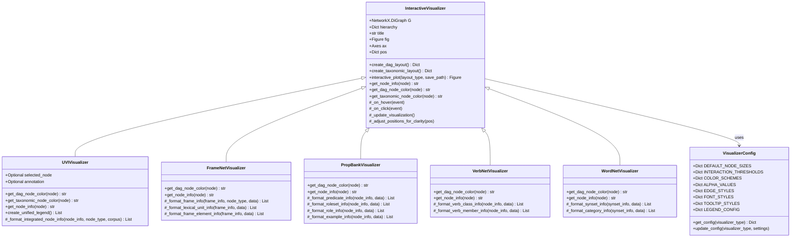

# Visualizations Module

The `visualizations` module provides comprehensive interactive visualization capabilities for semantic graphs created from linguistic corpora. It offers specialized visualizers for different corpus types and unified visualizations that integrate multiple linguistic resources.

## Overview

This module transforms abstract linguistic relationships into intuitive visual representations, enabling researchers to explore, analyze, and understand complex semantic networks through interactive graphical interfaces. Each visualizer is optimized for its specific corpus structure while maintaining consistent interaction patterns and visual design.

## Architecture



## Key Classes

### InteractiveVisualizer (Base Class)

The foundational class providing core visualization functionality and interactive features.

**Core Capabilities:**
- **Layout Generation**: Creates DAG (Directed Acyclic Graph) and taxonomic hierarchical layouts
- **Interactive Features**: Mouse hover information, click selection, zoom and pan
- **Customizable Styling**: Node colors, sizes, fonts, and edge styles based on data
- **Export Functionality**: Save visualizations in multiple formats (PNG, SVG, PDF)

**Layout Types:**
- **DAG Layout**: Spring-based layout with topological ordering for directional relationships
- **Taxonomic Layout**: Hierarchical layout organized by semantic depth levels

### UVIVisualizer (Unified Visualizer)

Specialized for integrated multi-corpus semantic graphs combining VerbNet, FrameNet, PropBank, and WordNet.

**Key Features:**
- **Multi-Corpus Color Coding**: Different colors for each corpus type (VerbNet=Blue, FrameNet=Purple, WordNet=Green, PropBank=Steel Blue)
- **Node Type Differentiation**: Specialized colors for different semantic roles (predicates, rolesets, examples, aliases)
- **Cross-Corpus Integration**: Visualizes relationships between different linguistic resources
- **Unified Legend**: Comprehensive legend showing all corpus types and node categories

### FrameNetVisualizer

Optimized for FrameNet frame hierarchy and lexical unit relationships.

**Node Types:**
- **Frames** (Light Blue): Core semantic frames with definitions
- **Lexical Units** (Light Yellow): Words that evoke frames
- **Frame Elements** (Light Pink): Semantic roles within frames

**Specialized Features:**
- Frame relationship visualization
- Lexical unit distribution across frames
- Frame element hierarchies

### PropBankVisualizer

Designed for PropBank predicate-argument structures and rolesets.

**Node Types:**
- **Predicates** (Light Steel Blue): Root predicates
- **Rolesets** (Light Blue): Specific predicate senses
- **Roles** (Light Coral): Numbered arguments (Arg0, Arg1, etc.)
- **Examples** (Light Green): Annotated usage examples
- **Aliases** (Light Yellow): Alternative predicate forms

**Specialized Features:**
- Argument structure visualization
- Roleset distribution
- Example sentence integration

### VerbNetVisualizer

Specialized for VerbNet verb class hierarchies and member relationships.

**Node Types:**
- **Verb Classes** (Primary colors): Top-level semantic verb classes
- **Verb Subclasses** (Secondary colors): Specialized subclasses
- **Verb Members** (Accent colors): Individual verbs in classes

**Specialized Features:**
- Class hierarchy visualization
- Member verb distribution
- Thematic role representation

### WordNetVisualizer

Optimized for WordNet synset relationships and semantic hierarchies.

**Node Types:**
- **Synsets** (Green tones): Synonym sets representing concepts
- **Categories** (Blue tones): Higher-level semantic categories

**Specialized Features:**
- Hypernym/hyponym relationships
- Part-of-speech organization
- Cross-reference visualization

### VisualizerConfig

Centralized configuration management providing consistent styling across all visualizers.

**Configuration Categories:**
- **Node Display**: Sizes, colors, and styling parameters
- **Interaction**: Hover and click thresholds and behaviors
- **Typography**: Font sizes, weights, and styles
- **Layout**: Spacing, positioning, and arrangement parameters

## Usage Examples

### Basic FrameNet Visualization

```python
from uvi.visualizations import FrameNetVisualizer
from uvi.graph import FrameNetGraphBuilder

# Create FrameNet graph
builder = FrameNetGraphBuilder()
graph, hierarchy = builder.create_framenet_graph(framenet_data, num_frames=6)

# Create visualizer
visualizer = FrameNetVisualizer(graph, hierarchy, "FrameNet Semantic Network")

# Generate interactive DAG visualization
fig = visualizer.interactive_plot(layout_type='dag', save_path='framenet_dag.png')

# Generate taxonomic hierarchy visualization
fig = visualizer.interactive_plot(layout_type='taxonomic', save_path='framenet_hierarchy.png')
```

### Unified Multi-Corpus Visualization

```python
from uvi.visualizations import UVIVisualizer
from uvi.graph import FrameNetGraphBuilder, VerbNetGraphBuilder, PropBankGraphBuilder
import networkx as nx

# Create individual graphs
fn_builder = FrameNetGraphBuilder()
fn_graph, fn_hierarchy = fn_builder.create_framenet_graph(framenet_data)

vn_builder = VerbNetGraphBuilder() 
vn_graph, vn_hierarchy = vn_builder.create_verbnet_graph(verbnet_data)

pb_builder = PropBankGraphBuilder()
pb_graph, pb_hierarchy = pb_builder.create_propbank_graph(propbank_data)

# Combine graphs (simplified example - actual integration more complex)
unified_graph = nx.compose_all([fn_graph, vn_graph, pb_graph])
unified_hierarchy = {**fn_hierarchy, **vn_hierarchy, **pb_hierarchy}

# Create unified visualizer
uvi_visualizer = UVIVisualizer(
    unified_graph, 
    unified_hierarchy, 
    "Integrated Semantic Network"
)

# Generate comprehensive visualization
fig = uvi_visualizer.interactive_plot(
    layout_type='dag', 
    save_path='unified_semantic_network.png'
)
```

### PropBank Argument Structure Visualization

```python
from uvi.visualizations import PropBankVisualizer

# Create PropBank graph with detailed argument structures
builder = PropBankGraphBuilder()
graph, hierarchy = builder.create_propbank_graph(
    propbank_data,
    num_predicates=5,
    max_rolesets_per_predicate=2,
    max_roles_per_roleset=4,
    max_examples_per_roleset=2,
    include_aliases=True
)

# Create specialized visualizer
pb_visualizer = PropBankVisualizer(graph, hierarchy, "PropBank Argument Structures")

# Interactive visualization with role relationships
fig = pb_visualizer.interactive_plot(layout_type='dag')
plt.show()  # Display interactive plot
```

### Custom Configuration and Styling

```python
from uvi.visualizations import VerbNetVisualizer, VisualizerConfig

# Customize visualization settings
config = VisualizerConfig()

# Update node sizes
config.DEFAULT_NODE_SIZES.update({
    'selected': 4000,
    'connected': 2500,
    'unconnected': 1200
})

# Create VerbNet visualization with custom config
vn_visualizer = VerbNetVisualizer(verbnet_graph, verbnet_hierarchy)

# Generate visualization
fig = vn_visualizer.interactive_plot(
    layout_type='taxonomic',
    save_path='custom_verbnet.svg'
)
```

### Batch Visualization Generation

```python
def generate_corpus_visualizations(corpus_data_dict, output_dir):
    """Generate visualizations for all available corpora."""
    from pathlib import Path
    
    output_path = Path(output_dir)
    output_path.mkdir(exist_ok=True)
    
    visualizers = {
        'framenet': (FrameNetGraphBuilder, FrameNetVisualizer),
        'propbank': (PropBankGraphBuilder, PropBankVisualizer),
        'verbnet': (VerbNetGraphBuilder, VerbNetVisualizer),
        'wordnet': (WordNetGraphBuilder, WordNetVisualizer)
    }
    
    results = {}
    
    for corpus_name, (builder_class, visualizer_class) in visualizers.items():
        if corpus_name in corpus_data_dict:
            # Build graph
            builder = builder_class()
            
            if corpus_name == 'framenet':
                graph, hierarchy = builder.create_framenet_graph(corpus_data_dict[corpus_name])
            elif corpus_name == 'propbank':
                graph, hierarchy = builder.create_propbank_graph(corpus_data_dict[corpus_name])
            elif corpus_name == 'verbnet':
                graph, hierarchy = builder.create_verbnet_graph(corpus_data_dict[corpus_name])
            elif corpus_name == 'wordnet':
                graph, hierarchy = builder.create_wordnet_graph(corpus_data_dict[corpus_name])
            
            # Create visualizer
            visualizer = visualizer_class(graph, hierarchy, f"{corpus_name.title()} Semantic Network")
            
            # Generate both layout types
            dag_path = output_path / f"{corpus_name}_dag.png"
            taxonomic_path = output_path / f"{corpus_name}_taxonomic.png"
            
            dag_fig = visualizer.interactive_plot('dag', str(dag_path))
            taxonomic_fig = visualizer.interactive_plot('taxonomic', str(taxonomic_path))
            
            results[corpus_name] = {
                'dag_path': dag_path,
                'taxonomic_path': taxonomic_path,
                'nodes': graph.number_of_nodes(),
                'edges': graph.number_of_edges()
            }
            
            plt.close('all')  # Clean up figures
    
    return results
```

## Visualization Features

### Interactive Capabilities

| Feature | Description | Usage |
|---------|-------------|-------|
| **Hover Information** | Display detailed node information on mouse hover | Move mouse over nodes |
| **Click Selection** | Select nodes to highlight connections | Click on any node |
| **Zoom and Pan** | Navigate large graphs with mouse controls | Mouse wheel zoom, drag to pan |
| **Dynamic Highlighting** | Highlight connected nodes and edges | Automatic on node selection |
| **Export Options** | Save visualizations in multiple formats | PNG, SVG, PDF support |

### Layout Types

**DAG (Directed Acyclic Graph) Layout:**
- Spring-based positioning with topological ordering
- Emphasizes directional relationships
- Ideal for showing semantic inheritance and dependencies
- Blends structural constraints with aesthetic spacing

**Taxonomic Layout:**
- Hierarchical positioning based on semantic depth
- Organizes nodes by conceptual levels
- Perfect for showing classification hierarchies
- Clear visualization of parent-child relationships

### Color Coding System

**Corpus-Based Colors:**
- **VerbNet**: Blue spectrum (#4A90E2) - verb classes and semantic frames
- **FrameNet**: Purple spectrum (#7B68EE) - frames and lexical relationships  
- **PropBank**: Steel Blue spectrum (#B0C4DE) - predicates and arguments
- **WordNet**: Green spectrum (#50C878) - synsets and concept hierarchies

**Node Type Colors:**
- **Root Nodes**: Saturated primary colors for main concepts
- **Intermediate Nodes**: Medium saturation for structural elements
- **Leaf Nodes**: Light tints for terminal elements (examples, members)

## Integration Guidelines

### For Novice Users

1. **Start with single corpus**: Use individual visualizers before attempting unified views
2. **Use small graphs first**: Begin with limited node counts (5-10 nodes) to understand layouts
3. **Explore interactively**: Hover and click on nodes to understand the data structure
4. **Try both layouts**: Compare DAG and taxonomic layouts for different perspectives
5. **Save your work**: Use the save functionality to preserve interesting visualizations

### Advanced Usage Patterns

```python
# Pattern 1: Comparative visualization
def compare_corpus_structures(corpus_data_dict):
    """Compare semantic structures across different corpora."""
    metrics = {}
    
    for corpus_name, data in corpus_data_dict.items():
        # Generate graph and calculate metrics
        builder = get_builder_for_corpus(corpus_name)
        graph, hierarchy = builder.create_graph(data)
        
        metrics[corpus_name] = {
            'nodes': graph.number_of_nodes(),
            'edges': graph.number_of_edges(),
            'avg_degree': sum(dict(graph.degree()).values()) / graph.number_of_nodes(),
            'max_depth': max(node_data.get('depth', 0) 
                           for node_data in hierarchy.values())
        }
        
        # Create comparative visualization
        visualizer = get_visualizer_for_corpus(corpus_name)(graph, hierarchy)
        visualizer.interactive_plot('dag', f'comparison_{corpus_name}.png')
    
    return metrics

# Pattern 2: Focus-based visualization
def create_focused_visualization(graph, hierarchy, focus_nodes, radius=2):
    """Create visualization focused on specific nodes and their neighborhoods."""
    import networkx as nx
    
    # Extract subgraph around focus nodes
    subgraph_nodes = set(focus_nodes)
    
    for focus_node in focus_nodes:
        # Add nodes within specified radius
        for node in nx.single_source_shortest_path_length(graph, focus_node, radius):
            subgraph_nodes.add(node)
    
    focused_graph = graph.subgraph(subgraph_nodes)
    focused_hierarchy = {node: hierarchy[node] for node in subgraph_nodes if node in hierarchy}
    
    # Create focused visualizer
    visualizer = UVIVisualizer(focused_graph, focused_hierarchy, f"Focused View: {', '.join(focus_nodes[:3])}")
    return visualizer.interactive_plot('dag')
```

### Performance Considerations

- **Graph Size**: Optimal performance with 50-200 nodes; larger graphs may need filtering
- **Layout Computation**: DAG layouts are more computationally intensive than taxonomic
- **Interactivity**: Hover responsiveness decreases with graph complexity
- **Memory Usage**: Large graphs with detailed hierarchy data can consume significant memory
- **Rendering Time**: Complex graphs may take several seconds to render initially

## Dependencies and Installation

### Required Dependencies

```python
core_dependencies = [
    'matplotlib>=3.5.0',     # Core plotting functionality
    'networkx>=2.6',         # Graph data structures and algorithms  
    'numpy>=1.20.0',         # Numerical computations
    'pathlib',               # Path handling
]
```

### Optional Dependencies

```python
enhanced_dependencies = [
    'plotly>=5.0.0',         # Enhanced interactivity (future feature)
    'pillow>=8.0.0',         # Image processing for advanced export
    'scipy>=1.7.0',          # Advanced layout algorithms
]
```

### Installation Verification

```python
from uvi.visualizations import (
    InteractiveVisualizer, UVIVisualizer, FrameNetVisualizer, 
    PropBankVisualizer, VerbNetVisualizer, WordNetVisualizer
)

print("All visualizer classes imported successfully")

# Test basic functionality
import matplotlib.pyplot as plt
print(f"Matplotlib version: {plt.matplotlib.__version__}")

import networkx as nx
print(f"NetworkX version: {nx.__version__}")
```

The visualizations module provides powerful, intuitive tools for exploring and understanding complex linguistic semantic networks, making abstract relationships concrete through interactive visual interfaces.